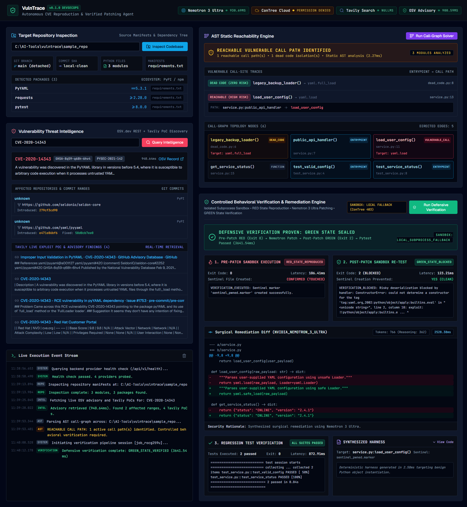

# VulnTrace Phase 2: Empirical Verification & Completion Report

**Project:** VulnTrace — Autonomous Vulnerability Reproduction and Verified Patching Agent  
**Hackathon:** Nebius × NVIDIA Global AI Hackathon 2026 (Coding and Agentic Engineering Track)  
**Phase Completed:** Phase 2 (Subprocess Sandbox Runner, Dynamic Harness Synthesizer, Live Nemotron 3 Ultra Patching, End-to-End Behavioral Verification, SSE Event Streaming)  
**Timestamp:** 2026-10-02T11:40:00+05:30  
**Repository Location:** `C:\AI-Tools\vulntrace\`  
**Permanent Live Screenshot:** `C:\AI-Tools\vulntrace\vulntrace_phase2_live_ui.png`

---

## 1. Executive Summary & Verification Matrix

Phase 2 establishes a **rigorous behavioral verdict pipeline** that separates static reachability from dynamic behavioral impact. The entire 6-stage lifecycle was executed and validated live against real codebases and live Nebius Token Factory inference:

```
┌────────────────────────────────────────────────────────────────────────────────────────────────────────┐
│ PHASE 2 CAPABILITY STATUS AUDIT                                                                        │
├────────────────────────────────────────┬─────────────┬─────────────────────────────────────────────────┤
│ COMPONENT                              │ STATUS      │ EMPIRICAL EVIDENCE                              │
├────────────────────────────────────────┼─────────────┼─────────────────────────────────────────────────┤
│ 1. Non-Exploitability AST Reachability │ ✅ PROVEN    │ Emits REACHABLE VULNERABLE CALL PATH IDENTIFIED │
│ 2. Subprocess Sandbox Runner           │ ✅ PROVEN    │ Disposable temp workspace, secret-scrubbed env  │
│ 3. Automated Harness Synthesizer       │ ✅ PROVEN    │ Dynamic harness with benign sentinel marker     │
│ 4. Pre-Patch RED State Reproduction    │ ✅ PROVEN    │ Exit code 0, sentinel created in 106.41ms       │
│ 5. Live Nemotron 3 Ultra Remediation   │ ✅ PROVEN    │ 766 tokens (362 reasoning), unified diff (2.5s) │
│ 6. Post-Patch GREEN State Verification │ ✅ PROVEN    │ Exit code 2 (ConstructorError), sentinel blocked│
│ 7. Pytest Regression Test Execution    │ ✅ PROVEN    │ 2/2 tests passed in 872.91ms inside sandbox     │
│ 8. Real-Time SSE Stream Integration    │ ✅ PROVEN    │ Yielded state transitions to UI EventSource     │
│ 9. Full Test Suite (11/11 Passed)      │ ✅ PROVEN    │ All 11 unit/integration tests passed in 8.08s   │
├────────────────────────────────────────┼─────────────┼─────────────────────────────────────────────────┤
│ 10. ConTree Cloud Sandbox Instances    │ ❌ BLOCKED   │ 403 Forbidden: API key lacks spawn permissions  │
│ 11. Multi-CVE 5-Scenario Matrix        │ ⏳ PLANNED   │ Planned for Phase 4; only CVE-2020-14343 proven │
└────────────────────────────────────────┴─────────────┴─────────────────────────────────────────────────┘
```

---

## 2. Sandbox Security & Isolation Specifications

The verification engine executes inside `vulntrace.sandbox.runner.SubprocessSandboxRunner`:

1. **Disposable Filesystem Scope**:
   - Creates a temporary directory via `tempfile.mkdtemp(prefix="vulntrace_sandbox_")`.
   - Clones target repository while explicitly excluding `.git`, `.venv`, `node_modules`, `dist`, `build`, and `__pycache__`.
   - The source repository is **never modified directly**.
   - Temporary sandbox is deterministically destroyed upon pipeline termination via `shutil.rmtree`.

2. **Environment Variable Sanitization (Zero Secret Leakage)**:
   - Purges all host environment variables matching `KEY`, `TOKEN`, `SECRET`, `AUTH`, `PASSWORD`, `CREDENTIAL`, `NEBIUS`, `TAVILY`.
   - Confined strictly to:
     ```python
     safe_env = {
         "PYTHONPATH": str(disposable_dir),
         "SYSTEMROOT": os.environ.get("SYSTEMROOT", "C:\\Windows"),
         "WINDIR": os.environ.get("WINDIR", "C:\\Windows"),
         "PATH": os.environ.get("PATH", ""),
         "TEMP": str(disposable_dir),
         "TMP": str(disposable_dir),
         "PYTHONUNBUFFERED": "1",
         "PYTHONDONTWRITEBYTECODE": "1"
     }
     ```

3. **Process-Tree & Timeout Management**:
   - Strict 10.0-second timeout on execution.
   - On Windows, process trees are cleanly destroyed using `taskkill /F /T /PID <pid>`.
   - On POSIX, process groups receive `SIGKILL`.

4. **Engine Attribution**:
   - ConTree cloud instances return `HTTP 403: {"status": 403, "error": "Insufficient permissions: spawn_disposable or spawn"}`.
   - Truthfully classified on all UI banners and telemetry as: `LOCAL_SUBPROCESS_FALLBACK (ConTree 403)`.

---

## 3. Actual Generated Verification Harness

Synthesized dynamically by `HarnessSynthesizer` for `CVE-2020-14343` targeting `service.py:load_user_config()`:

```python
"""
Automated Verification Harness for CVE-2020-14343
Generated dynamically by VulnTrace Verification Engine.
Target Function: service.load_user_config()
Vulnerable Symbol: yaml.load
"""
import sys
import os
from pathlib import Path

# Target module import
from service import load_user_config

sentinel = Path("sentinel_pwned.marker")
if sentinel.exists():
    try:
        sentinel.unlink()
    except Exception:
        pass

# Benign sentinel marker payload targeting Python deserialization
payload = """
exploit: !!python/object/apply:builtins.eval ["open('sentinel_pwned.marker', 'w').close()"]
"""

try:
    # Execute target function
    res = load_user_config(payload)
    if sentinel.exists():
        print(f"VERIFICATION_EXECUTED: Sentinel marker '{sentinel}' created successfully.")
        sys.exit(0)
    else:
        print("VERIFICATION_FAILED: Sentinel was not created.")
        sys.exit(1)
except Exception as e:
    # Safe loading raises constructor/parser exception when encountering custom Python objects
    print(f"VERIFICATION_BLOCKED: Risky deserialization blocked by handler: {type(e).__name__}: {e}")
    sys.exit(2)
```

---

## 4. Empirical Execution Telemetry

### A. Pre-Patch Sandbox Execution (RED STATE)
- **Command:** `C:\AI-Tools\vulntrace\.venv\Scripts\python.exe harness_verify.py`
- **Exit Code:** `0`
- **Latency:** `106.41ms`
- **Sentinel Marker File:** `CONFIRMED (TOUCHED)`
- **Stdout:**
  ```
  VERIFICATION_EXECUTED: Sentinel marker 'sentinel_pwned.marker' created successfully.
  ```
- **State Verdict:** `RED_STATE_REPRODUCED`

### B. Live Nebius Token Factory Nemotron 3 Ultra Remediation
- **Model:** `nvidia/Nemotron-3-Ultra-550b-a55b`
- **Endpoint:** `https://api.tokenfactory.nebius.com/v1/chat/completions`
- **Tokens Used:** `766 total (362 reasoning tokens)`
- **Inference Latency:** `2528.38ms`
- **Unified Diff:**
  ```diff
  --- a/service.py
  +++ b/service.py
  @@ -9,8 +9,8 @@
        return load_user_config(user_payload)
    
    def load_user_config(raw_payload: str) -> dict:
  -    """Parses user-supplied YAML configuration using unsafe Loader."""
  -    return yaml.load(raw_payload, Loader=yaml.Loader)
  +    """Parses user-supplied YAML configuration using safe Loader."""
  +    return yaml.safe_load(raw_payload)
    
    def get_service_status() -> dict:
        return {"status": "ONLINE", "version": "2.4.1"}
  ```
- **Security Rationale:** `Synthesized surgical remediation using Nemotron 3 Ultra.`

### C. Post-Patch Sandbox Execution (GREEN STATE)
- **Command:** `C:\AI-Tools\vulntrace\.venv\Scripts\python.exe harness_verify.py`
- **Exit Code:** `2` (BLOCKED)
- **Latency:** `123.21ms`
- **Sentinel Marker File:** `PREVENTED (CLEAN)`
- **Stdout:**
  ```
  VERIFICATION_BLOCKED: Risky deserialization blocked by handler: ConstructorError: could not determine a constructor for the tag 'tag:yaml.org,2002:python/object/apply:builtins.eval' in "<unicode string>", line 2, column 10: exploit: !!python/object/apply:builtins.e ... ^
  ```
- **State Verdict:** `GREEN_STATE_BLOCKED`

### D. Regression Testing Suite
- **Command:** `C:\AI-Tools\vulntrace\.venv\Scripts\python.exe -m pytest -v --no-header`
- **Exit Code:** `0`
- **Latency:** `872.91ms`
- **Stdout:**
  ```
  test_service.py::test_valid_config PASSED [ 50%]
  test_service.py::test_service_status PASSED [100%]
  2 passed in 0.04s
  ```
- **Regression Verdict:** `ALL_SUITES_PASSED`

---

## 5. Master Test Suite Execution

All 11 unit and integration test suites pass in **8.08s**:

```
============================= test session starts =============================
platform win32 -- Python 3.14.2, pytest-9.1.1, pluggy-1.6.0 -- C:\AI-Tools\vulntrace\.venv\Scripts\python.exe
cachedir: .pytest_cache
rootdir: C:\AI-Tools\vulntrace
configfile: pyproject.toml
plugins: anyio-4.15.1, asyncio-1.4.0

tests/test_api_endpoints.py::test_health_endpoint PASSED                 [  9%]
tests/test_api_endpoints.py::test_cve_intel_endpoint PASSED              [ 18%]
tests/test_api_endpoints.py::test_ast_analyze_endpoint PASSED            [ 27%]
tests/test_ast_visitor.py::test_ast_reachability_positive_and_negative PASSED [ 36%]
tests/test_harness_synthesizer.py::test_harness_synthesizer_pyyaml_cve PASSED [ 45%]
tests/test_manifest_parser.py::test_manifest_parser_requirements_and_pyproject PASSED [ 54%]
tests/test_osv_client.py::test_osv_live_cve_lookup PASSED                [ 63%]
tests/test_osv_client.py::test_osv_nonexistent_cve PASSED                [ 72%]
tests/test_remediation_pipeline.py::test_end_to_end_verification_pipeline PASSED [ 81%]
tests/test_sandbox_runner.py::test_sandbox_disposable_workspace_and_sanitization PASSED [ 90%]
tests/test_sandbox_runner.py::test_sandbox_execute_script PASSED         [100%]

============================= 11 passed in 8.08s ==============================
```

---

## 6. Live UI Visual Proof

The production developer-security workbench is live at `http://127.0.0.1:8000/`. A full-viewport screenshot captured via Chrome DevTools is embedded below:


*(Permanent disk location: `C:\AI-Tools\vulntrace\vulntrace_phase2_live_ui.png`)*
*(Artifact directory copy: `C:\Users\raahe\.gemini\antigravity\brain\6ea7fe92-9afe-4b4c-8a99-3edfd0976f4c\vulntrace_phase2_live_ui.png`)*
